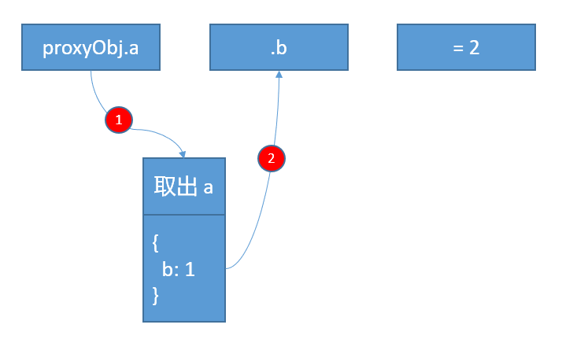
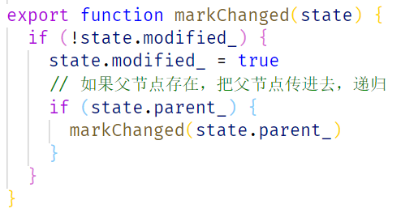

# 1	前言

> `immerJs`是《不可变数据类型》的一种实现方式，如果还不知道如何使用的小伙伴，可以去看看我之前写的文章 [ImmerJs使用详解](https://juejin.cn/post/7023944098578956324)

距离上一篇使用文章的发布已经过去了一个月的时间，本篇文章本来想在使用教程的那一周一起发布，但是由于懒的缘故，一直拖到了现在


# 2	Proxy

在学习`immerJs`的原理之前，还需要了解一下 `proxy`。如果已经学会 `Proxy`的小伙伴，可以直接跳到👉 [第三章](# 3	immerJs原理解析)

大家应该都知道，`Proxy`是用来监听数据变化的，当对象中的某个值发生变化的时候，就会被 `Proxy` 拦截，`Vue3`中就是借助这个特性知道哪些数据发生变化，对应的哪些`DOM`需要发生变化，而`React`就需要遍历整棵虚拟`dom`树，从而找出变化的项

`immerJs`也是使用`Proxy`实现的，通过监听哪些值发生变化，针对性的修改变化的值的地址指向，没有修改的值保留旧的引用，从而节省内存空间，下图是借用网络上对`immutableJs`介绍的图片进行基本原理演示


## 2.1	Proxy的“缺陷”

先看看`Proxy`怎么用的，`Proxy`第二个参数是一个对象，可以传入 `get`，`set`，`deleteProperty`等拦截事件，当对对象进行增，删，改的时候，都会触发对应的方法

```ts
const obj = {
  a: 'a',
  b: 'b',
  c: 'c'
}

const proxyObj = new Proxy(obj, {
  get(state, key) {
    console.log(`获取了${key}`)
    return Reflect.get(state, key)
  },
  set(state, key, value) {
    console.log(`${key}值发生了变化，变成了${value}`)
    return Reflect.set(state, key, value)
  },
  deleteProperty(state, key) {
    console.log(`${key}被删除了`)
    return Reflect.deleteProperty(state, key)
  }
})

proxyObj.a = 'a-1'
proxyObj.b
delete proxyObj.b
```

控制台的打印如下，可以看到，每次获取和修改值的之后，都会触发 `Proxy` 的第二个参数中对应的拦截函数


似乎一切都很完美，但是有一点，`Proxy`无法做到，就是对其深层次对象的监听，如下

```ts
const obj = {
  a: {
    b: 1
  }
}

const proxyObj = new Proxy(obj, {
  get(state, key) {
    console.log(`获取了${key}`)
    return Reflect.get(state, key)
  },
  set(state, key, value) {
    console.log(`${key}值发生了变化，变成了${value}`)
    return Reflect.set(state, key, value)
  },
  deleteProperty(state, key) {
    console.log(`${key}被删除了`)
    return Reflect.deleteProperty(state, key)
  }
})

proxyObj.a.b = 2
```

控制台打印如下


之所以会这样，是因为 `proxyObj.a.b = 2` 这句代码，其实可以把它看成三步逻辑


第一步，取出`a`的值，这个时候，就会触发`Proxy`的`get`代理，然后这个时候，会把 `{ b: 1 }` 这个对象返回


第二步，从 `{ b: 1 }` 这个对象中取 `b`，注意，这个时候， `{ b: 1 }` 可没有被`Proxy`代理过，自然不会被拦截，控制台也不会输出什么内容



最后再把`2`赋值给`b`，因为现在已经和`proxyObj`没什么关系了，所以`proxyObj`的代理方法也不会被触发


这其实并不是 `Proxy`的缺陷，因为这是合理的，如果子对象的修改也能触发父对象的拦截，那这就乱套了


## 2.2	Proxy.revocable

接下来，来学习一下 `Proxy` 上的一个静态方法 `revocable`，这个方法和`Proxy`的用途一致，只不过，比`Proxy`多了一个功能，就是可以取消代理，使用如下

```ts
const obj = {
  a: 'a',
  b: 'b',
  c: 'c'
}

const { proxy, revoke } = Proxy.revocable(obj, {
  get(state, key) {
    console.log(`获取了${key}`)
    return Reflect.get(state, key)
  },
  set(state, key, value) {
    console.log(`${key}值发生了变化，变成了${value}`)
    return Reflect.set(state, key, value)
  },
  deleteProperty(state, key) {
    console.log(`${key}被删除了`)
    return Reflect.deleteProperty(state, key)
  }
})

proxy.a = 'a-1'
proxy.b

revoke()

delete proxy.b
```

当执行`revoke`后，`proxy`对象就会被销毁


好，到此为止，`immerJs`原理解析的前置知识就已经讲解完毕，接下来就要进入重头戏


# 3	immerJs原理解析

我们复习一下`immerJs`是如何使用的

```ts
import produce from 'immer'

const baseState = {
  a1: {
    b1: {
      c1: 'c1',
    },
    b2: {
      c2: 'c2'
    }
  },
  a2: 'a2'
}

const nextState = produce(baseState, (draft) => {

  draft.a2 = 'a2-edit'

  draft.a1.b.c1 = 'c1-edit'

})

// 根节点引用变了
console.log(baseState === nextState)			    // false
// a1和子节点引用变了，所以a1也变了
console.log(nextState.a1 === baseState.a1)	      	// false
// b2和子节点没修改过，所以b2还是原来的引用
console.log(nextState.a1.b2 === baseState.a1.b2)	// true
```

`immerJs`的使用可以简化为三部分，即

-  **对基础数据进行预处理：**`produce`

- **对数据进行修改逻辑：**`recipe`

- **修改后的数据：**`nextState`

对数据进行修改的部分，在`immerJs`中的形参名为 `recipe`，那么接下来，我们就用 `recipe`来形容它


## 3.1	对象

我们就以上面例子中那个对象为例子

```ts
const baseState = {
  a1: {
    b1: {
      c1: 'c1',
    },
    b2: {
      c2: 'c2'
    }
  },
  a2: 'a2'
}
```

描述的成图形结构如下


接着开始原理讲解

### 3.1.1	定义捕获器

`immerJs`在全局定义了一个 `objectTraps`，用来保存 到时候要传入 `Proxy` 的第二个参数

```ts
const objectTraps = {
  get(state, prop) {
  },
  set(state, prop, value) {
  },
  has(state, prop) {
  },
  ownKeys(state) {
  },
  deleteProperty(state, prop) {
  }
}
```


### 3.1.2	对传入的对象进行代理

接着，对传入的`baseState`进行代理，但是不是直接把 `baseState` 传入 `Proxy.revocable`直接进行代理，而是创建了一个**中间对象**，这个**中间对象**由6个最基本的元素组成

- **parent_:**  存放`baseState`的父节点，由于当前是根节点，所以这个值现在为`null`

-  **base_:**  存放`baseState`
-  **copy_:**  暂时定义为`null`，后面要用
-  **draft_:**   把这个中间理对象传入  `Proxy.revocable` ，保存返回的 `proxy`
-  **revoke_:  ** 把这个中间理对象传入  `Proxy.revocable` ，保存返回的 `revoke`
- **modified_:** 暂时定义为`false`，后面要用

然后，把这个**中间对象**传入  `Proxy.revocable` 中，记得第二个参数要传递刚才定义的 `objectTraps`，把返回的 `proxy`，`revoke`分别存入到中间对象中，图如下


### 3.1.3	执行recipe

接着，直接执行`produce`传入的第二个参数，即 `recipe`，把第二步生成的**中间对象**传递给`recipe`，也就是说，`recipe`中操作的`draft`其实就是我们在第二步生成的那个中间对象


接着，就会执行`recipe`中的第一行语句，即 

```ts
draft.a1.b1.c1 = 'c1-edit'
```

那么，这句话其实可以拆成 `3` 步逻辑，即第一步，从 `draft`  中取出 `a1`，这时，便会触发刚才我们定义的 `traps`。

现在是获取`a1`的值，那么就会触发`objectTraps.get`这个方法。在这个`trap` 中，一定会接收到两个参数，第一个是刚才我们为 `baseState` 创建的中间对象 ，第二个是要获取的`key`即`a1`，这个`trap`的执行流程图如下


那么 `draft.a1` 这一语句的执行的流程如下


之所以要为`a1`的值创建中间对象并返回，因为`Proxy`只能监听第一层的变化，子元素的变化`Proxy`的监听不了，如果直接返回`a1`的值，那么到这里就断掉了，子元素的修改`immerJs`监听不到

那么第二步，就是 从 `a1` 中取出 `b1`，因为刚才返回了`a1`的中间对象的代理，所以，也会走上面的 `get trap`  流程，自然，也会为 `b1` 创建一个中间对象并代理，到此为止，在内存中，就会形成一个链表


执行最后一步，就是 `draft.a1.b1.c1 = 'c1-edit'` 中的`b1.c1 = 'c1-edit'`这一阶段，因为刚才为`b1`创建了中间对象并为中间对象创建了代理，所以这一步会被 `set trap` 拦截到，在这个`trap` 中，一定会接收到三个参数，第一个是刚才我们为 `b1` 创建的中间对象，第二个是要设置的`key`即`c1`，第三个是要设置的新值`'c1-edit'`。

**中间对象**中，有一个标识`modified_`一直没用过，其实这个标识是用来判断当前这个节点是否被设置过新的值，先记住它，最后处理的时候要使用。那么，`set trap`的执行流程图如下


那么 `b1.c1 = 'c1-edit'` 这一语句的执行的流程如下


### 3.1.4	生成新对象

ok！`recipe`已经执行完成！我们得到了下面右边那个数据结构


接下来，我们只需要从`baseState`的中间对象开始往下遍历，执行一定的逻辑，就能得到一个复用无修改节点的新的对象，流程如下


到此，最基本的`immerJs`的原理就说完了


## 3.2	数组

数组其实和对象是一样的，比如下面这么一个数组

```ts
const arr = [
    { id: 1 },
    { id: 2 },
    { id: 3 },
    { id: 4 }
]
```

其实可以看成一个对象

```ts
const arr = {
    0: { id: 1 },
    1: { id: 2 },
    2: { id: 3 },
    3: { id: 4 },
}
```

也就是说，`proxy traps`的逻辑不需要动，只需要在生成中间对象的时候，标识一下需要生成中间对象的元素是数组还是普通对象


然后，在生成新对象的时候，判断当前的中间对象是数组还是普通对象，然后使用不同的方式遍历和赋值


# 4	immer

终于讲完原理了，接下来开始手写`immer`，当然这里只是简单的实现，项目的目录结构如下

```shell
├── immer
│   ├── index.js		 -- immer-mini 入口
│   ├── proxy.js		 -- 创建中间对象和存放 traps 的地方
│   ├── finalize.js      -- 把中间对象转化成普通对象
│   ├── constants.js	 -- 存放常量
│   └── utils.js		 -- 存放工具方法
└── index.js
```

本人建议直接跳到第五章，直接把代码拉下来看，如果某个函数看不懂，再看下面的内容，因为下面太废话了，还不如直接看实现来的快

## 4.1	constants.js

> 这是存放常量的文件，这里只需要存放两个常量，如下

一个就是中间对象中，用来标识当前代理的值是数组还是对象

```ts
/** 判断代理的是对象还是数组 */
export const ProxyType = {
  ProxyObject: 'ProxyObject',
  ProxyArray: 'ProxyArray'
}
```

还有一个，就是一个单纯的`Symbol`

```ts
/** 方便取到代理的对象 */
export const DRAFT_STATE = Symbol.for('immer-state')
```

这个`Symbol`是这么用的，`immerJs`的核心就是中间对象，但是我们其实在外部是无法直接访问这个中间对象的，因为我们不管怎么访问，就会经过 `get traps`，所以我们要约定一下，定义一个 `Symbol key` ，当取这个`proxy`对象的`DRAFT_STATE`的时候，其实就是取这个中间对象


## 4.2	utils.js

> 用来定义7个最基本的函数，如果认真看过上面的原理解析的话，那么这几个函数就会知道是干嘛用的了

### 4.2.1	isDraftable

这个函数在源码里面其实不是这么写的，但是因为这里是简化版，所以做了一些修改。`isDraftable`就干了一件事情，判断传入的`value`是否可以创建中间对象吗？这里只有传入`Object`，`Array`才会返回`true`


### 4.2.2	latest

这几乎是最常用的一个函数了，用来获取中间对象中的 `copy_` 或 `base_`


### 4.2.3	has

判断某一个对象上是否存在这个属性


我们来看下面这个这个例子，判断一个对象上是否存在这个属性需要使用`hasOwnProperty`，如果直接判断是否等于`undefined`，会存在问题

```ts
const obj = { name: 1, address: '' }
obj.__proto__ = { age: 2 }

console.log(obj.hasOwnProperty('name'))     // true
console.log(obj.hasOwnProperty('age'))      // false
console.log(obj.hasOwnProperty('address'))  // true

console.log('---')

console.log(obj.name !== undefined)     // true
console.log(obj.age !== undefined)      // true
console.log(obj.address !== undefined)  // true
```

### 4.2.4	peek

没什么好说的，函数字面意思


### 4.2.5	markChanged

把当前中间对象的 `modified_` 和父节点的 `modified_` 全部改成`true`



### 4.2.6	prepareCopy

浅拷贝`base_`到中间对象的`copy_`上


### 4.2.7	is

判断两个值是否相同，在 `set trap`的时候会用到，下面的`is`其实就是 `Object.is`的`Polyfill`，之所以这么写，因为`immerJs`中需要添加对`es5`的支持


## 4.3	proxy.js

具体代码见[github](https://github.com/bpuns/immer-study/blob/master/immer-mini/src/immer/proxy.js)，注释写的非常详细，有两部分组成


## 4.4	finalize.js

处理`recipe`结束之后的根中间对象，生成新的对象


## 4.5	index.js

接下来就是入口与文件，判断传入的`base`是否可以创建中间对象，如果可以，才执行上面的所有逻辑，要么就直接返回


# 5	结尾

上方的源码，我已经放到`git`仓库了，地址： https://github.com/bpuns/immer-study

其中有三个文件夹

**immer-source：** `immerJs`的源码

- 就是官方源码

**immer-simple：** `immerJs`的简单实现

- 官方源码简化版本，没有处理边缘情况，所以可能会存在`bug`
- 不支持 `Map`，`Set`代理
- 不支持跟踪变化
- `produce`不支持第三个参数

**immer-mini：** `immerJs`的`mini`的`mini`版本

- 核心原理实现，不会处理边缘情况，所以可能会存在`bug`
- 只支持对象和数组的代理，只支持修改，增加，删除最简单实现

